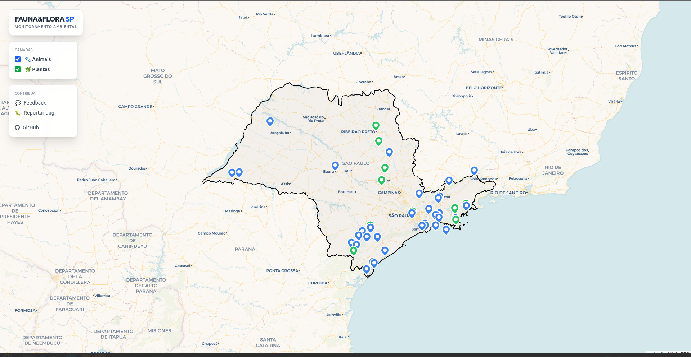
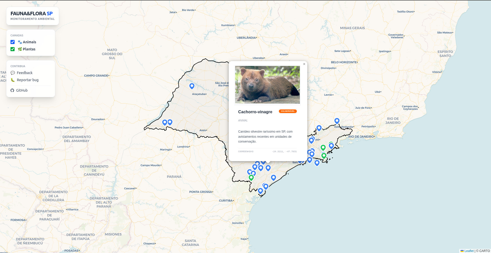
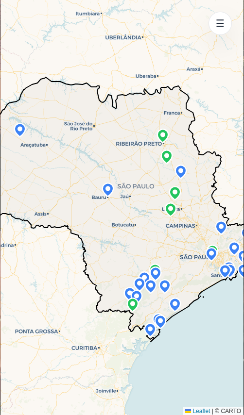
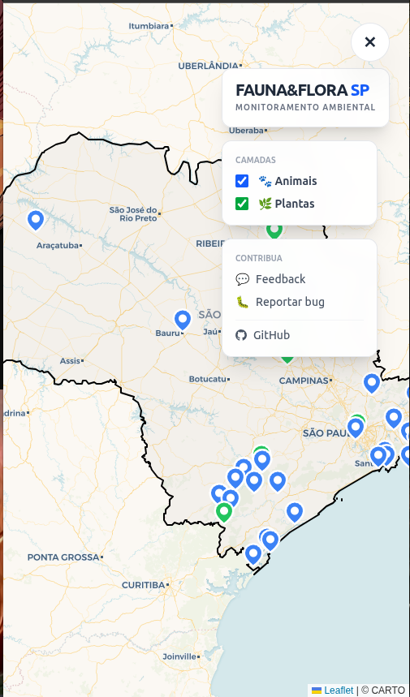

# 🐾 Fauna & Flora SP

### Projeto de Atividade Extensionista
Um ecossistema digital completo projetado para o monitoramento, catalogação e visualização geográfica de espécies da fauna e flora no estado de São Paulo. Este projeto integra conceitos de **Sistemas de Informação Geográfica (GIS)**, **Desenvolvimento Fullstack** e **Segurança de Dados**.

---

## 📸 Demonstração do Ecossistema

### Interface Web (Desktop)
A versão Desktop oferece uma experiência imersiva com mapas interativos e painéis de controle laterais para filtragem de camadas e acesso rápido a ferramentas de contribuição.

<div align="center">
  
  
</div>

### Interface Mobile (Adaptável)
Utilizando princípios de **Responsive Design**, a interface mobile adapta-se automaticamente, ocultando painéis densos em um menu flutuante expansivo para garantir a usabilidade em campo.

<div align="center">
  
  
</div>

---

## 🛠️ Stack Tecnológica

### **Frontend & Mobile**
* **Framework:** Next.js 14 (App Router)
* **Estilização:** Tailwind CSS (Mobile First)
* **Mapas:** React Leaflet + Leaflet.js
* **GeoDados:** GeoJSON (Fronteiras do Estado de SP)

### **Backend & Segurança**
* **Runtime:** Node.js + TypeScript
* **Servidor:** Express.js
* **ORM:** Prisma (PostgreSQL)
* **Segurança:** * **Helmet.js:** Proteção de headers e Content Security Policy (CSP).
  * **Express Rate Limit:** Prevenção contra ataques de força bruta e DoS.
  * **CORS:** Gerenciamento de acessos cross-origin.

### **Infraestrutura (Cloud)**
* **Database:** Neon.tech (Serverless PostgreSQL)
* **API Hosting:** Render.com (com Cron-job heartbeat para 24/7 uptime)
* **Frontend Hosting:** Vercel

---

## 📂 Estrutura do Repositório

```text
atividade-extencionista/
├── backend/               # Servidor API, Prisma Schema e Rotas
├── fauna_flora_frontend/  # Web App Next.js (Interface principal)
├── fauna_e_flora_mobile/  # Protótipos/Imagens da interface mobile
└── public/                # GeoJSON e Ativos de documentação (Imagens)